# MVP de Engenharia de Dados: pontualidade das entregas Olist

**Disciplina:** MVP de pipeline de dados na nuvem, pós-graduação em Ciência de Dados e Analytics da PUC-Rio.
**Situação verificada:** os CSVs foram enviados a um volume do Unity Catalog, seis tabelas Delta aparecem no catálogo e as consultas de qualidade e análise foram executadas em notebooks no Databricks Free Edition. As capturas abaixo mostram essas etapas e permitem confrontar os resultados com as consultas SQL do repositório.
**Plataforma alvo:** Databricks Free Edition, Python/PySpark, SQL, volume do Unity Catalog e tabelas Delta. Google Colab não faz parte desta entrega.

O [índice das evidências](evidencias/README.md) explica o que cada captura comprova; as imagens principais estão incorporadas nas seções do relatório.

## Contexto de Negócios e Perguntas

A Olist conecta compras de comércio eletrônico no Brasil. A data prometida de entrega é uma referência para a experiência do cliente. Este MVP investiga onde e quando os pedidos chegaram após a previsão e compara, de forma exploratória, grupos de frete. A finalidade é oferecer um conjunto de dados confiável no grão de pedido para responder:

1. Como varia a taxa de atraso das entregas por estado do cliente?
2. Como evolui a taxa de atraso das entregas por mês da compra?
3. Como a taxa de atraso se distribui entre faixas de frete total por pedido?

Estas são as perguntas originais, definidas antes da modelagem. O recorte inicial usa apenas [pedidos](https://www.kaggle.com/datasets/olistbr/brazilian-ecommerce), itens e clientes da mesma fonte. Pedidos oferecem status, compra, entrega real e previsão; clientes oferecem UF; itens oferecem frete. A viabilidade prática de cada resposta depende das contagens de cobertura medidas no [perfilamento](notebooks/02_perfilamento_e_modelagem.ipynb).

| Medida | População e grão | Numerador | Denominador | Referência temporal | Limite |
| --- | --- | --- | --- | --- | --- |
| Taxa de atraso | Um pedido com status delivered e datas real e prevista presentes | Pedidos cuja **data civil** da entrega real é posterior à prevista | Pedidos elegíveis no grupo | Mês da **compra** na série; data prevista para classificar atraso | Pedidos não entregues e entregues sem as duas datas não recebem resultado; hora do dia é ignorada |
| Taxa por UF | Mesma população, agrupada pela UF do cliente | Elegíveis atrasados na UF | Elegíveis na UF | Período de compras observado | UF desconhecida fica em grupo separado; não descreve origem do envio |
| Taxa por mês | Mesma população, agrupada pelo mês da compra | Elegíveis atrasados no mês | Elegíveis no mês | Mês civil da compra | Meses de borda e com baixa cobertura de entregas requerem cautela |
| Taxa por frete | Mesma população, dividida em quartis do **frete total por pedido**; ausentes e negativos em grupos próprios | Elegíveis atrasados na faixa | Elegíveis na faixa | Período completo de compras | Comparação descritiva, sem inferência causal; quartis não controlam distância, peso ou rota |

Uma taxa é nula quando o denominador é zero. Todas as consultas exibem tamanho da amostra e número de atrasados.

### Fonte e estrutura bruta

A fonte original é [Brazilian E-Commerce Public Dataset by Olist](https://www.kaggle.com/datasets/olistbr/brazilian-ecommerce), publicada pela Olist no Kaggle. A página informa aproximadamente 100 mil pedidos de 2016 a 2018 e dados anonimizados. A licença indicada na página é [CC BY-NC-SA 4.0](https://creativecommons.org/licenses/by-nc-sa/4.0/): atribuição, uso não comercial e compartilhamento pela mesma licença ao redistribuir material adaptado. Este projeto acadêmico atribui a fonte e descreve as transformações; os arquivos originais não são publicados no repositório. O intervalo observado de compras é **04/09/2016 a 17/10/2018**, também exibido pelo notebook 05 no Databricks.

| Arquivo bruto | Grão esperado | Colunas originais |
| --- | --- | --- |
| olist_orders_dataset.csv | Um pedido por order_id | order_id, customer_id, order_status, order_purchase_timestamp, order_approved_at, order_delivered_carrier_date, order_delivered_customer_date, order_estimated_delivery_date |
| olist_order_items_dataset.csv | Um item por (order_id, order_item_id) | order_id, order_item_id, product_id, seller_id, shipping_limit_date, price, freight_value |
| olist_customers_dataset.csv | Um registro por customer_id | customer_id, customer_unique_id, customer_zip_code_prefix, customer_city, customer_state |

Os campos de preço e frete pertencem a itens, enquanto o status e as datas de entrega pertencem a pedidos. Essa diferença de grão determina a agregação antes da junção.

## Carga dos Dados

1. Obter manualmente o pacote na página original da Olist no Kaggle e extrair **somente os três CSVs selecionados** para a carga. A data do download e o identificador exato da versão não foram registrados; os hashes abaixo identificam os arquivos efetivamente usados.
2. No Databricks, abrir [01_ingestao.ipynb](notebooks/01_ingestao.ipynb) em uma Git folder do repositório. Informar no widget catalogo o catálogo do workspace, se o catálogo corrente não for o correto. Executar as células de configuração que criam os esquemas olist_mvp_raw, olist_mvp_silver, olist_mvp_gold e o volume gerenciado originais.
3. Na interface, escolher **Novo → Adicionar ou carregar dados → Carregar arquivos para volume**. Enviar os CSVs sem modificá-los à raiz do volume `/Volumes/<catalogo>/olist_mvp_raw/originais`. A [documentação de upload](https://docs.databricks.com/aws/en/volumes/volume-files) descreve esse caminho. A [orientação para Free Edition](https://docs.databricks.com/aws/en/getting-started/import-visualize-data) recomenda a interface porque o acesso externo do compute é restrito.
4. Executar o restante do notebook 01 para comprovar nomes, tamanhos, colunas, legibilidade e contagens. Registrar os valores observados e capturas reais.

Os CSVs no volume são a camada bruta preservada. O diretório local data/raw/ está no .gitignore. Nunca adicionar CSVs, credenciais ou tokens ao Git. Não usar a função de upload direto para criar tabelas: isso perderia a distinção entre arquivo original e transformação reproduzível.

**Arquivos analisados em 27/09/2026:** os três CSVs foram disponibilizados no diretório ignorado data/raw/. Os arquivos usados na conferência têm as seguintes contagens e SHA-256; a saída do notebook 01 no Databricks confirmou os mesmos hashes no volume:

| Arquivo | Linhas | SHA-256 |
| --- | ---: | --- |
| olist_orders_dataset.csv | 99.441 | 8df58ef3d2d7e9944010f7beecd9b75367f5588ec6e3c91cec19ae3345ef9ecf |
| olist_order_items_dataset.csv | 112.650 | 0bc4d068c4fe38cbb01bd90e8746e3c613fe7b4baef75fab7b0e329701c3e279 |
| olist_customers_dataset.csv | 99.441 | 983a422239e1712ded753b3bf9ecf47dc73f144d306029dcfa99e70a226883d2 |

O upload pela interface selecionou os três arquivos e o volume `workspace.olist_mvp_raw.originais`. Em seguida, o Explorador de Catálogo mostrou os três CSVs preservados nesse volume. A leitura Spark exibiu **99.441 pedidos, 112.650 itens e 99.441 clientes**, iguais às contagens dos arquivos utilizados na conferência.

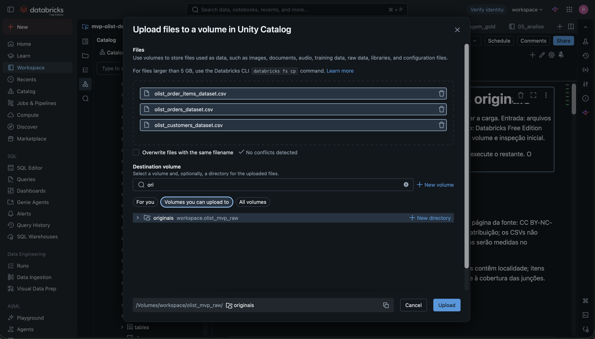

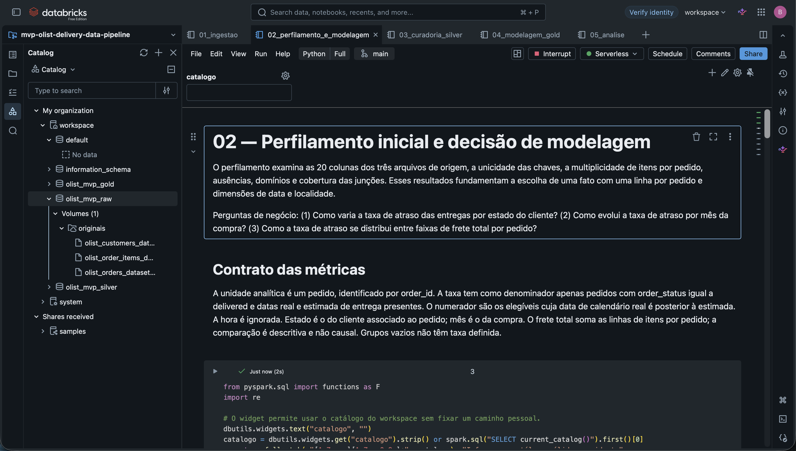

## Modelagem e Catálogo de Dados

### Decisão de grão

O modelo escolhido é uma estrela pequena: fato_pedidos no grão de order_id, dim_data no grão de dia civil e dim_localidade no grão de combinação normalizada de prefixo do CEP, cidade e UF. As três tabelas Silver mantêm os conceitos de origem e são tipadas. Uma tabela ampla facilitaria uma primeira consulta, mas repetiria localidade e calendário; um snowflake de localidade adicionaria tabelas e junções sem responder melhor às perguntas. A estrela mantém a fato auditável sem ampliar demais o MVP.

Uma junção direta de pedidos com itens geraria várias linhas para pedidos com mais de um item e poderia multiplicar contagens e taxas. Por isso, [04_modelagem_gold.ipynb](notebooks/04_modelagem_gold.ipynb) agrega itens por order_id antes de juntar o resultado à fato. Pedidos sem itens permanecem na fato com medidas monetárias nulas. A chave de localidade é um hash determinístico dos três atributos normalizados. Datas ausentes não recebem chave inventada.

### Catálogo transcrito das tabelas Silver

Cada linha abaixo descreve coluna, tipo, significado, domínio esperado e linhagem. Identificadores da Olist seguem o formato de 32 caracteres hexadecimais; datas precisam ser conversíveis. Faixas numéricas observadas neste recorte orientam a inspeção, sem truncar novos valores legítimos. Os limites e as exceções aparecem na seção de qualidade. As tabelas persistidas têm descrições e comentários de colunas no Unity Catalog.

**olist_mvp_silver.pedidos:** um registro tipado por pedido, vindo de olist_orders_dataset.csv; não há descarte de linhas.

| Coluna | Tipo | Significado e domínio esperado | Origem e transformação |
| --- | --- | --- | --- |
| order_id | STRING | Chave não vazia e única de pedido | order_id; remoção de espaços externos |
| customer_id | STRING | Identificador do cliente vinculado, não vazio para junção | customer_id; remoção de espaços externos |
| order_status | STRING | Estado do pedido: approved, canceled, created, delivered, invoiced, processing, shipped ou unavailable | order_status; minúsculas e espaços externos removidos |
| order_purchase_timestamp | TIMESTAMP | Instante da compra; de 04/09/2016 a 17/10/2018 neste recorte | order_purchase_timestamp; conversão tolerante |
| order_approved_at | TIMESTAMP | Instante da aprovação; pode faltar segundo o status | order_approved_at; conversão tolerante |
| order_delivered_carrier_date | TIMESTAMP | Instante de entrega à transportadora; pode faltar | order_delivered_carrier_date; conversão tolerante |
| order_delivered_customer_date | TIMESTAMP | Instante de entrega ao cliente; ausência esperada fora de delivered | order_delivered_customer_date; conversão tolerante |
| order_estimated_delivery_date | DATE | Dia prometido ao cliente; data civil válida | order_estimated_delivery_date; conversão tolerante para data |

**olist_mvp_silver.itens:** um registro tipado por chave (order_id, order_item_id), vindo de olist_order_items_dataset.csv; nenhum valor extremo é removido.

| Coluna | Tipo | Significado e domínio esperado | Origem e transformação |
| --- | --- | --- | --- |
| order_id | STRING | Pedido ao qual pertence o item; não vazio | order_id; remoção de espaços externos |
| order_item_id | INT | Sequência positiva do item dentro do pedido; 1 a 21 observados | order_item_id; conversão tolerante |
| product_id | STRING | Identificador do produto; texto não vazio esperado | product_id; remoção de espaços externos |
| seller_id | STRING | Identificador do vendedor; texto não vazio esperado | seller_id; remoção de espaços externos |
| shipping_limit_date | TIMESTAMP | Limite de envio informado para o item | shipping_limit_date; conversão tolerante |
| price | DECIMAL(18,2) | Preço do item em R$; não negativo, R$ 0,85 a R$ 6.735,00 observados | price; conversão tolerante |
| freight_value | DECIMAL(18,2) | Frete do item em R$; não negativo, R$ 0,00 a R$ 409,68 observados | freight_value; conversão tolerante |

**olist_mvp_silver.clientes:** um registro por customer_id, vindo de olist_customers_dataset.csv; localidade informada pelo cliente.

| Coluna | Tipo | Significado e domínio esperado | Origem e transformação |
| --- | --- | --- | --- |
| customer_id | STRING | Chave não vazia e única do registro de cliente | customer_id; remoção de espaços externos |
| customer_unique_id | STRING | Identificador persistente de cliente; não é grão da fato | customer_unique_id; remoção de espaços externos |
| customer_zip_code_prefix | STRING | Cinco dígitos do prefixo do CEP, inclusive zeros iniciais; 01003 a 99990 observados | customer_zip_code_prefix; preenchimento à esquerda até cinco posições |
| customer_city | STRING | Cidade declarada, texto não vazio esperado | customer_city; minúsculas e remoção de espaços externos |
| customer_state | STRING | UF declarada: AC, AL, AM, AP, BA, CE, DF, ES, GO, MA, MG, MS, MT, PA, PB, PE, PI, PR, RJ, RN, RO, RR, RS, SC, SE, SP ou TO | customer_state; maiúsculas e remoção de espaços externos |

### Catálogo transcrito das tabelas Gold

**olist_mvp_gold.dim_data:** calendário civil entre primeira e última data de compra válida.

| Coluna | Tipo | Significado e domínio esperado | Origem e transformação |
| --- | --- | --- | --- |
| data_compra | DATE | Chave única, um dia civil de 04/09/2016 a 17/10/2018 neste recorte | Mínimo e máximo de pedidos Silver; geração de calendário diário |
| ano | INT | Ano civil da data de compra; 2016 a 2018 neste recorte | Derivado de data_compra |
| mes | INT | Mês civil, de 1 a 12 | Derivado de data_compra |
| ano_mes | STRING | Ano e mês no formato AAAA-MM | Derivado de data_compra |

**olist_mvp_gold.dim_localidade:** uma linha por combinação distinta de atributos normalizados de cliente.

| Coluna | Tipo | Significado e domínio esperado | Origem e transformação |
| --- | --- | --- | --- |
| chave_localidade | STRING | Hash SHA-256 único da combinação de atributos | Estrutura de CEP, cidade e UF de clientes Silver |
| cep_prefixo | STRING | Prefixo do CEP, cinco dígitos ou nulo | customer_zip_code_prefix de clientes Silver |
| cidade | STRING | Cidade em minúsculas ou nula | customer_city de clientes Silver |
| estado | STRING | Uma das 27 UFs listadas em clientes Silver, em maiúsculas, ou nula | customer_state de clientes Silver |

**olist_mvp_gold.fato_pedidos:** uma linha por order_id, preservando todos os pedidos Silver.

| Coluna | Tipo | Significado e domínio esperado | Origem e transformação |
| --- | --- | --- | --- |
| order_id | STRING | Chave única e não nula do pedido | pedidos Silver |
| customer_id | STRING | Chave de cliente usada na junção | pedidos Silver |
| order_status | STRING | Estado normalizado do pedido | pedidos Silver |
| order_purchase_timestamp | TIMESTAMP | Instante da compra ou nulo se inválido/ausente | pedidos Silver |
| order_delivered_customer_date | TIMESTAMP | Instante real de entrega ou nulo | pedidos Silver |
| order_estimated_delivery_date | DATE | Data civil prevista ou nula | pedidos Silver |
| data_compra | DATE | Chave para dim_data; nula se compra sem data válida | Data civil de order_purchase_timestamp |
| chave_localidade | STRING | Chave para dim_localidade; nula sem cliente correspondente | Junção por customer_id, hash dos atributos de cliente Silver |
| qtd_itens | BIGINT | Número de itens, inteiro positivo de 1 a 21 observados; nulo se sem itens | Contagem de itens Silver agrupados por order_id |
| valor_itens_total | DECIMAL(28,2) | Soma completa dos preços em R$; não negativa, até R$ 13.440,00 observados; nula sem itens ou com preço ausente | Soma de price por order_id, condicionada à completude |
| frete_total | DECIMAL(28,2) | Soma completa do frete em R$; não negativa, até R$ 1.794,96 observados; nula sem itens ou com frete ausente | Soma de freight_value por order_id, condicionada à completude |
| pedido_entregue_com_datas | INT | 1 para entregue com ambas as datas; 0 nos demais casos | Regra única em [indicadores_entrega.sql](sql/indicadores_entrega.sql) |
| entrega_atrasada | INT | 1 para atraso, 0 para pontual, nulo fora da população elegível | Comparação das datas civis real e estimada na mesma regra SQL |

O tipo decimal da soma está previsto como DECIMAL(28,2) pela regra de soma do Spark para entradas DECIMAL(18,2). As capturas do Unity Catalog mostram as tabelas Silver e Gold como objetos Delta gerenciados, com descrições e comentários de colunas. O catálogo transcrito acima cobre todas as colunas, inclusive as que não cabem na altura de uma única captura.

**Catálogo Silver —** as três tabelas aparecem no painel à esquerda. As telas de Overview registram os comentários de [clientes](evidencias/04_catalogo_silver_clientes.png), [itens](evidencias/04_catalogo_silver_itens.png) e [pedidos](evidencias/04_catalogo_silver_pedidos.png).

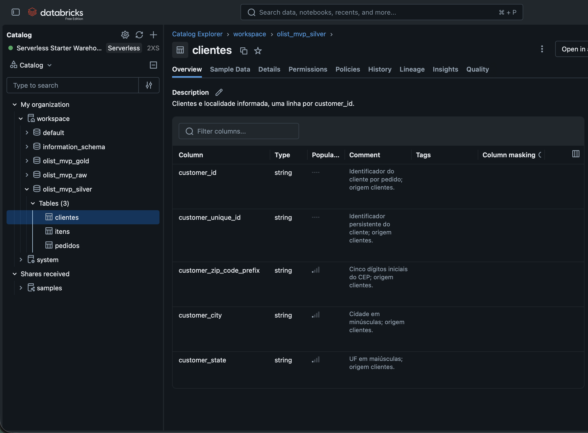

**Catálogo Gold —** o painel lista [dim_data](evidencias/05_catalogo_gold_data.png), [dim_localidade](evidencias/05_catalogo_gold_localidade.png) e [fato_pedidos](evidencias/05_catalogo_gold_fato.png).

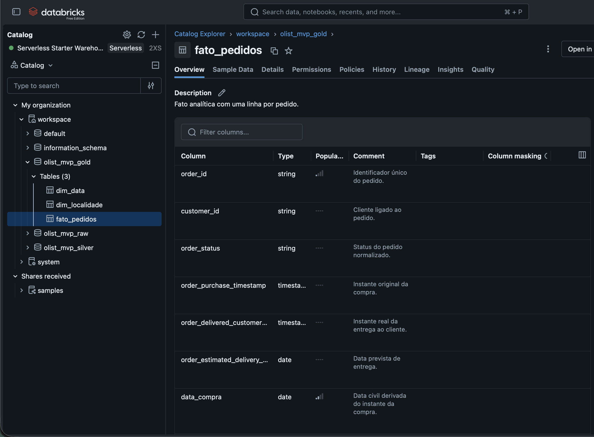

## Pipeline de Dados

A ordem de execução é:

1. [01 — ingestão](notebooks/01_ingestao.ipynb): cria objetos e inspeciona os CSVs brutos preservados.
2. [02 — perfilamento e modelagem](notebooks/02_perfilamento_e_modelagem.ipynb): mede as características de cada atributo, chaves, cardinalidades e cobertura. A interpretação desses resultados precede a carga Silver.
3. [03 — curadoria Silver](notebooks/03_curadoria_silver.ipynb): valida chaves, padroniza texto, aplica conversões tolerantes, conta falhas e grava três tabelas Delta com overwrite.
4. [04 — modelo Gold](notebooks/04_modelagem_gold.ipynb): agrega itens, cria dimensões, calcula indicadores por uma única regra SQL, valida grão e junções, e grava três tabelas Delta com overwrite.
5. [05 — análise](notebooks/05_analise.ipynb): executa as três [consultas SQL](sql/), reconcilia denominadores e produz tabelas e gráficos em português.

As escritas são reexecutáveis com a mesma origem: overwrite substitui as tabelas sem acrescentar linhas. A Silver exige contagem igual à origem; chaves duplicadas ou nulas interrompem a carga em vez de receber deduplicação arbitrária. Na Gold, a contagem da fato deve ser igual à de pedidos Silver. A agregação de itens reconcilia a soma de qtd_itens com o número de linhas Silver. A construção falha quando dimensões multiplicam pedidos ou faltam referências para chaves não nulas.

| Transformação | Motivo | Efeito esperado e verificação |
| --- | --- | --- |
| Tipagem e normalização Silver | Tornar datas, moeda e localização consultáveis | Zero linhas perdidas; falhas de conversão contadas e valores nulos mantidos |
| Agregação dos itens por order_id | Preservar o grão de pedido | Muitas linhas de itens tornam-se no máximo uma linha agregada por pedido; soma de qtd_itens reconcilia |
| Junção com clientes e agregado | Enriquecer sem multiplicar pedidos | Linhas da fato iguais às linhas de pedidos Silver; ausências mantidas |
| Calendário e localidades distintos | Permitir agrupamento por mês e UF | Uma linha por data e por chave de localidade |
| Elegibilidade e atraso | Evitar classificar pedidos não entregues | Inelegíveis têm entrega_atrasada nula; elegíveis têm 0 ou 1 |

**Persistência observada:** o Explorador de Catálogo mostra os três CSVs no [volume de origem](evidencias/02_volume_arquivos.png). As telas de Overview das três tabelas Silver e três Gold, vinculadas na seção de catálogo, comprovam as tabelas Delta gerenciadas no catálogo `workspace`. A consulta final da fato exibiu **99.441 pedidos**, preservando o grão de pedido.

## Qualidade de Dados

O [notebook 02](notebooks/02_perfilamento_e_modelagem.ipynb) mede nulos e vazios por todas as 20 colunas iniciais, faixas textuais, duplicação de chaves, relação um para muitos, ausência de correspondências, status e datas, preços/fretes negativos e percentis. O [notebook 03](notebooks/03_curadoria_silver.ipynb) mede falhas de conversão, contagens antes/depois e ausências por status. O [notebook 04](notebooks/04_modelagem_gold.ipynb) verifica integridade referencial e grão da fato.

| Verificação ou problema | Tratamento definido | Registros afetados | Efeito sobre a análise |
| --- | --- | --- | --- |
| Chaves de pedido, item ou cliente nulas/duplicadas | Interromper a carga e investigar; não escolher linha arbitrária | 0 no perfilamento executado | Evita multiplicação e perda silenciosa |
| Data real ausente em pedido não entregue | Manter nula, sem resultado de pontualidade | 2.957 pedidos conforme agrupamento por status | Excluído apenas do denominador da taxa |
| Data real ou prevista ausente em pedido marcado delivered | Manter nula e relatar separadamente | 8 sem data real; 0 sem previsão | Pedido inelegível; reduz o denominador |
| Data ou valor monetário não conversível | Converter para nulo, contar falhas e preservar o arquivo original | 0 nas colunas avaliadas | Pode reduzir elegibilidade ou impedir comparação por frete |
| Preço/frete negativo ou extremo | Manter e medir; frete negativo aparece em faixa própria | 0 negativos; 8.427 preços e 11.613 fretes por item acima de Q3 + 1,5 × IQR | Nenhuma exclusão; extremos podem afetar médias, mas taxas por quartil usam contagens |
| Item sem pedido, pedido sem item/cliente ou entrega antes da compra | Medir e examinar antes de interpretar | 0 itens órfãos, 775 pedidos sem itens, 0 sem cliente, 0 entregas antes da compra | Fato preserva pedidos; 775 ficam sem medida monetária |
| Sequência operacional de datas incoerente | Preservar os campos brutos e sinalizar; não corrigir uma data sem fonte externa | 1.359 pedidos com transportadora antes da aprovação (166 também antes da compra); 23 entregas antes da transportadora; 1.382 pedidos distintos afetados | 1.373 afetados são elegíveis e 24 atrasados; os campos contraditórios não entram diretamente na regra de pontualidade |
| Período inicial ou final incompleto | Mostrar intervalo observado e cobertura mensal | Setembro/2016: 4 compras, 1 elegível; setembro/2018: 16 compras, 0 elegíveis; outubro/2018: 4 compras, 0 elegíveis | Meses de borda não sustentam tendência de atraso |

Seis pedidos com status canceled trazem data real de entrega; a regra da taxa mantém esses seis fora do denominador porque o status não é delivered. Quatro linhas de itens têm shipping_limit_date em 2020, além do período principal de compras; mantêm-se na Silver e não alteram a métrica de pontualidade, que não usa esse campo. Os 775 pedidos sem itens permanecem na fato, sem frete inventado. Não há ausências nas cinco colunas de clientes nem nas sete de itens; em pedidos, faltam 160 datas de aprovação, 1.783 de entrega à transportadora e 2.965 datas reais de entrega. O perfilamento no Databricks exibiu essas contagens principais. A auditoria complementar de sequência operacional nos CSVs encontrou as 1.382 anomalias distintas acima; o [notebook 02](notebooks/02_perfilamento_e_modelagem.ipynb) reproduz a contagem. Excluir exploratoriamente os 1.373 elegíveis afetados levaria a 6.510/95.097 = 6,85%, ante 6,77% na definição principal; não aplicamos essa exclusão por falta de evidência de erro na data real ou prevista.

Completude, consistência, unicidade, plausibilidade interna e extremos foram examinados; a acurácia externa de data ou endereço não pode ser demonstrada apenas com os três arquivos. **Nenhuma contagem foi inferida de exemplos encontrados na internet.** As capturas mostram [completude por coluna](evidencias/03_qualidade_completude.png), [chaves](evidencias/03_qualidade_chaves.png), [cobertura das junções](evidencias/03_qualidade_juncoes.png), [ausências por status](evidencias/03_qualidade_status.png) e [formatos e extremos](evidencias/03_qualidade_formatos_extremos.png).

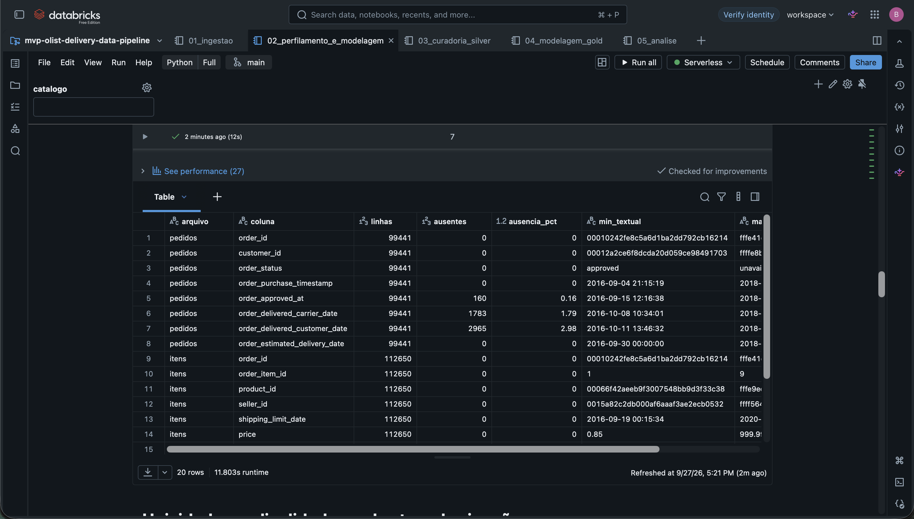

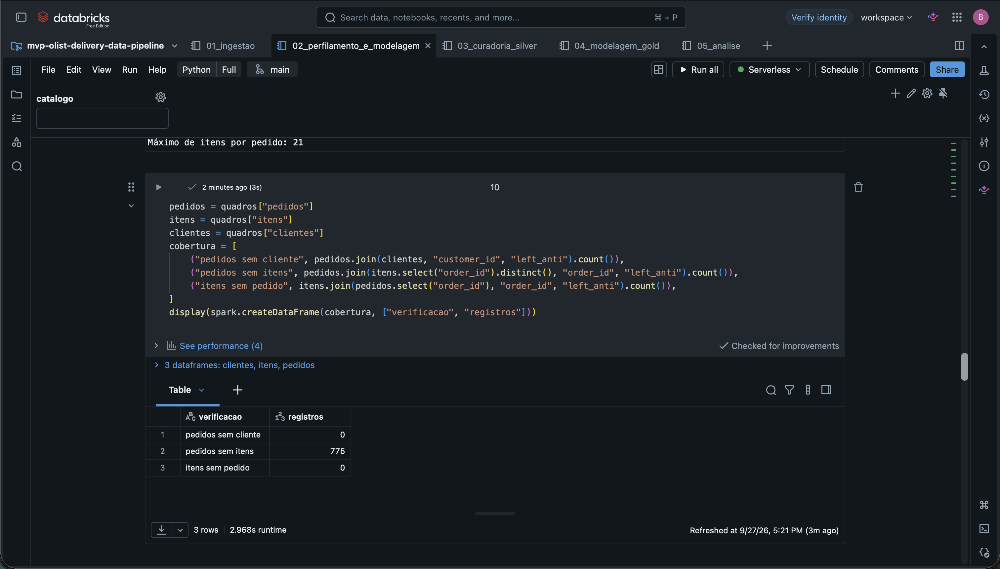

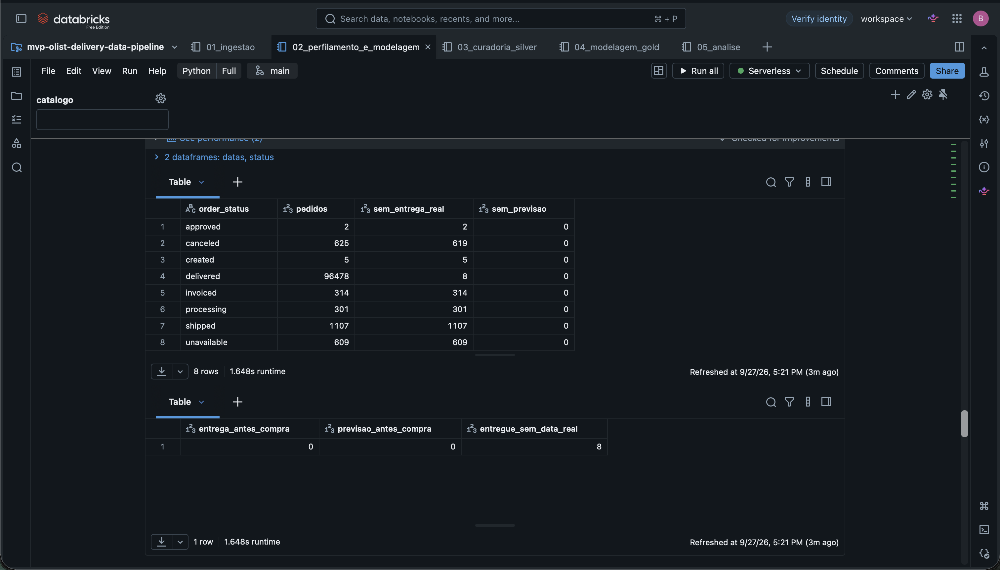

## Análise de Dados

As consultas estão em [atraso_por_uf.sql](sql/atraso_por_uf.sql), [atraso_por_mes.sql](sql/atraso_por_mes.sql) e [atraso_por_frete.sql](sql/atraso_por_frete.sql); os gráficos e reconciliações estão no [notebook 05](notebooks/05_analise.ipynb).

| Pergunta original | Saída planejada | Resultado e discussão |
| --- | --- | --- |
| Atraso por estado do cliente | Tabela com todos os estados, total, elegíveis, atrasados e taxa; gráfico das dez maiores amostras | Resultado: AL 85/397 = 21,41%; RJ 1.495/12.350 = 12,11%; SP 1.820/40.494 = 4,49%. AL lidera em proporção, mas com amostra muito menor que SP. |
| Evolução por mês da compra | Série mensal com total, elegíveis, atrasados, cobertura e taxa; inspeção dos meses de borda | Resultado: março/2018 1.328/7.003 = 18,96%; junho/2018 71/6.096 = 1,16%. Setembro e outubro/2018 têm zero elegíveis, portanto taxa indefinida. A oscilação não prova uma causa logística. |
| Faixas de frete total | Quartis de frete com limites observados, amostras, atrasados e taxa; grupos de frete ausente/negativo | Resultado: Q1 1.062/24.118 = 4,40% (R$ 0–13,85); Q2 6,99%; Q3 7,73%; Q4 1.920/24.117 = 7,96% (R$ 24,02–1.794,96). A diferença sugere associação, sem identificar causa. |

### Discussão dos resultados

As três consultas SQL foram executadas no notebook 05 do Databricks. As saídas visíveis de UF e frete coincidem com as contagens obtidas dos CSVs; a consulta mensal apresenta a série e seu gráfico. O resumo da fato mostra **99.441 pedidos, 96.470 elegíveis e 6.534 atrasados**, taxa geral de **6,77%**, e as consultas reconciliam o mesmo denominador global.

| Conferência cruzada | Cálculo sobre os CSVs | Captura do Databricks | Situação |
| --- | ---: | --- | --- |
| Pedidos totais | 99.441 | [99.441](evidencias/10_resumo_global.png) | Igual |
| Pedidos elegíveis | 96.470 | [96.470](evidencias/10_resumo_global.png) | Igual |
| Pedidos atrasados | 6.534 | [6.534](evidencias/10_resumo_global.png) | Igual |
| AL: atrasados / elegíveis | 85 / 397 | [85 / 397](evidencias/07_analise_uf_tabela.png) | Igual |
| Q1 e Q4 do frete | 4,40% e 7,96% | [4,40% e 7,96%](evidencias/09_analise_frete_tabela.png) | Igual |
| Novembro de 2017 | 904 / 7.288 = 12,40% | [904 / 7.288 = 12,40%](evidencias/08_analise_mes_tabela.png) | Igual |
| Março de 2018 | 1.328 / 7.003 = 18,96% | [1.328 / 7.003 = 18,96%](evidencias/08_analise_mes_tabela.png) | Igual |
| Junho de 2018 | 71 / 6.096 = 1,16% | [71 / 6.096 = 1,16%](evidencias/08_analise_mes_tabela.png) | Igual |

**Localidade.** AL tem a maior taxa observada, 21,41%, mas seus 397 pedidos elegíveis exigem cautela. Entre UFs com pelo menos 1.000 elegíveis, CE apresenta a maior taxa, 176/1.279 = 13,76%. RJ combina uma taxa elevada, 1.495/12.350 = 12,11%, com amostra muito maior; SP concentra 40.494 elegíveis e registra 4,49%. A comparação descreve a UF do cliente e não identifica onde ocorreu a demora logística.

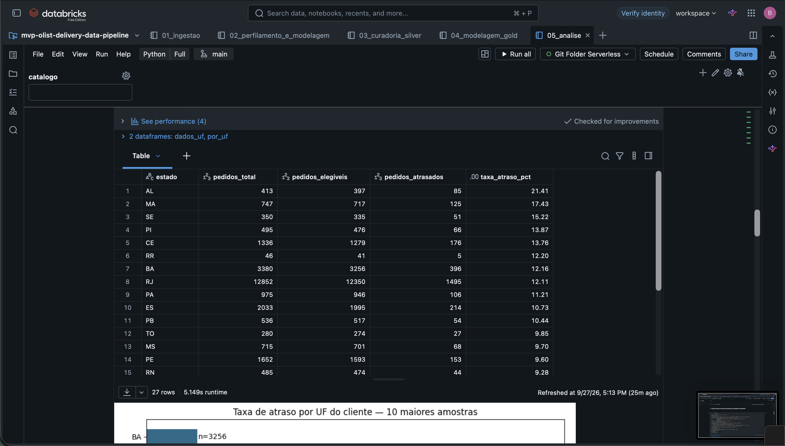

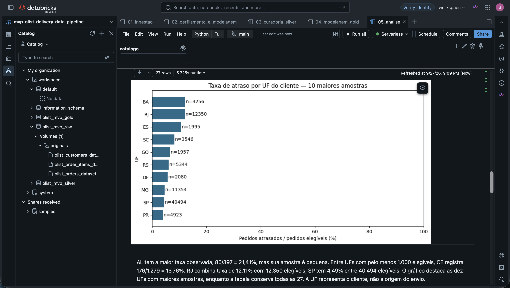

**Tempo.** Em março de 2018, 1.328 de 7.003 elegíveis atrasaram (18,96%), ante 71 de 6.096 em junho de 2018 (1,16%). A cobertura de elegibilidade desses meses foi 97,12% e 98,85%, respectivamente. Também há taxas elevadas em novembro de 2017 (12,40%) e fevereiro de 2018 (14,13%). Essas oscilações justificam investigar fatores operacionais, mas os três arquivos não demonstram suas causas. Setembro de 2016 tem apenas um elegível; setembro e outubro de 2018 têm zero, portanto não sustentam comparação de taxas.

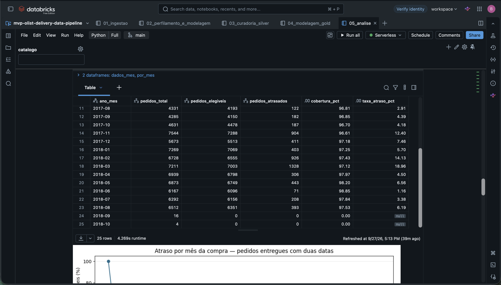

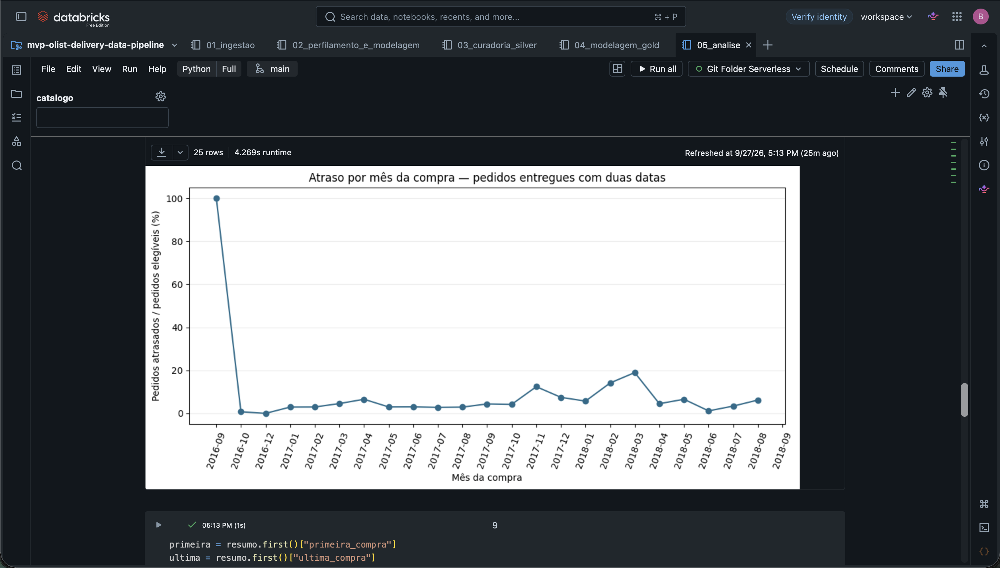

O notebook também [identifica os meses inicial e final incompletos](evidencias/08_analise_mes_periodos.png). A tabela acima mostra diretamente março e junho de 2018 e os meses finais sem taxa; os [primeiros meses da série](evidencias/08_analise_mes_inicio.png) também foram registrados.

**Frete.** Os quartis têm cerca de 24 mil pedidos elegíveis cada. A taxa sobe de 4,40% no primeiro para 7,96% no quarto, diferença de 3,56 pontos percentuais. Os limites monetários podem coincidir entre quartis porque pedidos com o mesmo frete foram distribuídos pelo ordenamento secundário de order_id. O frete pode refletir distância, dimensão do produto ou rota; a diferença de taxas é associação, não efeito causal do preço do frete.

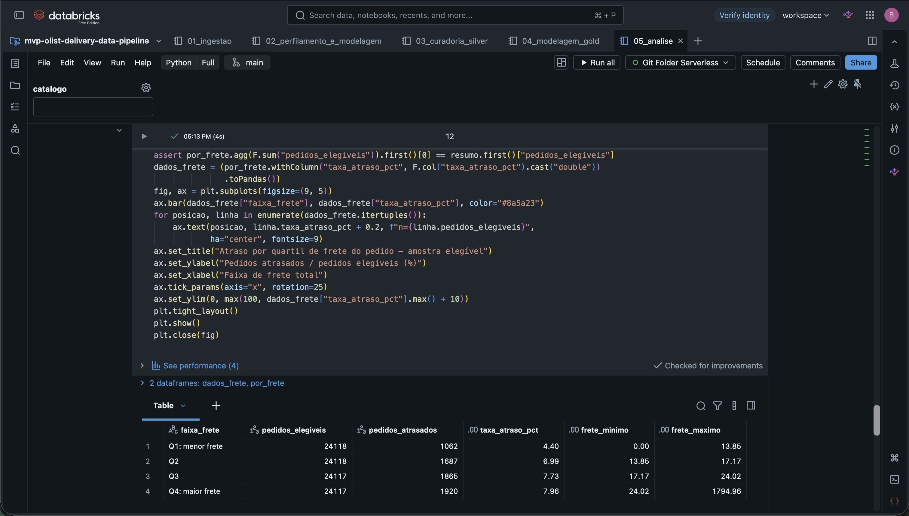

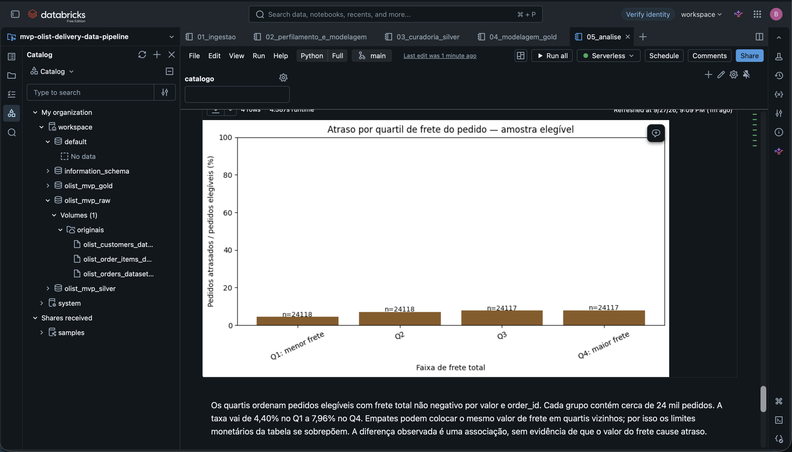

**Síntese dos resultados:** entre 99.441 pedidos, 96.470 são elegíveis e 6.534 têm entrega após a data prevista, taxa de 6,77%. Há diferenças por UF, oscilações mensais e associação com os quartis de frete, sujeitas às limitações acima. O mês da compra não é o mês da entrega, e o status e a maturidade do período afetam a cobertura. A captura do resumo executado no Databricks registra a reconciliação global.

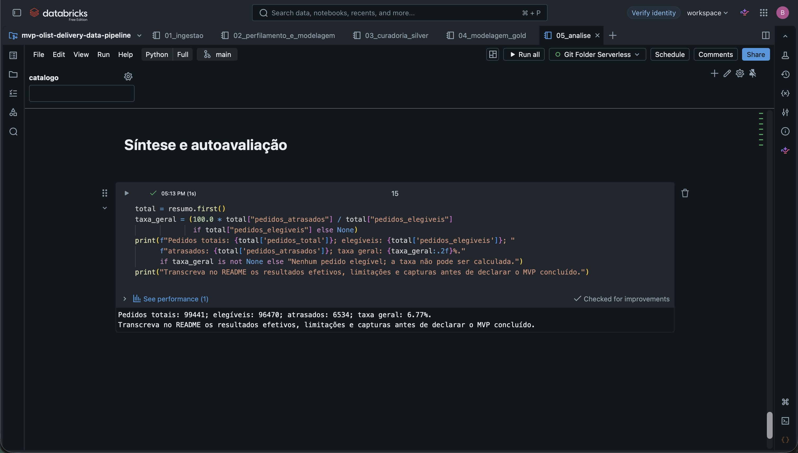

## Autoavaliação

As três perguntas originais permanecem no projeto: **como varia a taxa por estado; como evolui por mês da compra; como se distribui por faixas de frete total**. As três foram respondidas com consultas, tabelas e gráficos no Databricks. A fato no grão de pedido, as duas dimensões e as tabelas Silver aparecem persistidas no Unity Catalog. O perfilamento mostrou a necessidade de preservar 775 pedidos sem itens e de não classificar como pontuais os oito pedidos marcados delivered sem data real.

As principais dificuldades foram a carga manual dos CSVs no volume da Free Edition, a diferença de grão entre pedidos e itens e a conversão da taxa decimal para o tipo numérico aceito pelo gráfico. O tratamento manteve os arquivos originais, agregou itens antes da junção e converteu apenas a série usada na visualização, sem alterar o cálculo da taxa. A base é histórica; meses incompletos e a ausência de distância, peso e rota limitam a interpretação. A comparação por frete permanece descritiva.

Trabalho futuro útil, após concluir o MVP: acrescentar geolocalização ou dados de vendedores para estudar distância e origem do envio; testar a estabilidade das taxas por tamanho de amostra; e investigar dados mais recentes. Essas extensões não são pré-requisito para as três perguntas atuais.
